# 🚀 Real-World End-to-End AI-Powered Certifications Platform

An end-to-end, production-style web application that enables users to manage certifications, receive AI-based course recommendations, view analytics dashboards (for admin), and deploy services using modern DevOps practices.

This project demonstrates **full-stack development, AI/ML integration, analytics, and containerized deployment**, designed to mirror real-world enterprise systems.

---

## 🧠 Key Features

* User authentication and profile management
* Certification and course tracking (free & premium)
* AI-powered course recommendations (local embeddings, no paid APIs)
* Analytics dashboards (admin-only, role-based access control)
* Dockerized services with Kubernetes manifests
* CI/CD pipeline using GitHub Actions

> **Note:** The main focus is on integrating AI/ML, React frontend, Spring Boot backend, and Analytics. Core functionality is implemented; advanced features can be added in the future.

---

## 🏗️ High-Level Architecture

```
React Frontend
      ↓
Spring Boot Backend  ──→  Analytics DB
      ↓
AI Recommendation Service (Local Embeddings / RAG)
```

* Frontend communicates with backend via REST APIs
* Backend integrates with AI service for recommendations
* Analytics APIs power admin-only dashboards

---

## 📁 Repository Structure

```
certify_ai_frontend/     → React frontend (UI, dashboards, recommendations, RBAC)
certify-ai-backend/      → Spring Boot backend APIs
certify_ai_service/      → AI/ML recommendation service (local embeddings)
k8s/                     → Kubernetes manifests (Minikube)
docker-compose.yml       → Local multi-service setup
```

> Sensitive files, docs, build artifacts, and caches are excluded using `.gitignore`.

---

## 🧩 Layer-Wise Implementation

### 🔹 Layer 1: Frontend (React.js)

* React application initialized from scratch
* Login & Signup pages connected to backend APIs
* Dashboard displaying courses and certifications (free & premium)
* Profile page with backend integration
* AI chatbot for skill-based course recommendations
* Bootstrap-based responsive UI
* Basic client-side error handling
* Role-Based Access Control (RBAC) for analytics page (admin only)

  * Admin credentials:

    * Username: `admin@example.com`
    * Password: `hashedpassword3`

---

### 🔹 Layer 2: AI / ML Integration

* Independent AI module setup
* **Local embedding–based recommendation system** (no OpenAI / paid APIs)
* RAG-style similarity matching
* Users enter skills → top 3 relevant courses returned
* AI service tested independently
* Backend → AI service integration via REST
* Prompt tuning and similarity logic refinement

> 💡 Design choice: Local embeddings were used to avoid external API dependencies and improve explainability and cost control.

---

Perfect — we can **update your Analytics section** to fully reflect the features you implemented. Here’s how you can modify it in your README:

---

### 🔹 Layer 3: Analytics (Admin Only)

* Analytics data model for users, courses, and certifications
* ETL pipeline for analytics data population
* Analytics REST APIs
* Dashboard components:

  * **Charts** (usage, course popularity) with **download options** (PNG export)
  * **Tables** (user activity, certifications) with **CSV/Excel export**
  * **KPI Cards** on top for new / active / inactive users; clicking a KPI expands a **detailed table** of user info
* Access controlled via frontend RBAC (admin only)
* Foundation for predictive analytics (optional extension)

---

### 🔹 Layer 4: DevOps & Deployment

* Dockerfiles for:

  * Frontend
  * Backend
  * AI service
* Docker Compose for local development
* Kubernetes manifests for production-style deployment
* Minikube used for local Kubernetes testing
* CI/CD pipeline using GitHub Actions

**Known Issue (Documented):**

> Mixing Docker Compose (browser-accessible services) with Kubernetes in-cluster DNS can cause local networking challenges when using Minikube. This limitation is documented as part of the learning outcomes.

---

## ▶️ Running the Project Locally

### Option 1: Run Services Individually (Local Development)

* **Frontend (React):**
  [http://localhost:3000](http://localhost:3000)
* **Backend (Spring Boot):**
  [http://localhost:8080](http://localhost:8080)
* **AI Service (Python – Local):**
  [http://localhost:8000](http://localhost:8000)

> Used during development and independent testing of each component.

### Option 2: Docker Compose (Recommended)

```bash
docker-compose up --build
```

Services:

* Frontend: [http://localhost:3000](http://localhost:3000)
* Backend: [http://localhost:8080](http://localhost:8080)
* **AI Service (Docker): [http://localhost:5000](http://localhost:5000)**

> Docker Compose normalizes service networking and simulates production-style container communication.

### Option 3: Kubernetes (Local – Minikube)

```bash
minikube start
kubectl apply -f k8s/
```

> Note: Local browser access may require additional networking configuration when using Minikube.

---

## ⚙️ Configuration Notes

* AI service runs on **port 8000** during local (non-Docker) development
* AI service runs on **port 5000** when containerized via Docker
* Backend switches AI service endpoints based on environment configuration
* Analytics dashboard accessible only to users with admin credentials

---

## 🛠️ Tech Stack

**Frontend**

* React.js
* Bootstrap

**Backend**

* Spring Boot
* REST APIs
* JWT Authentication

**AI / ML**

* Python
* Local Embeddings
* RAG-style similarity search

**Analytics**

* SQL / Snowflake (design + ETL)
* Analytics APIs

**DevOps**

* Docker
* Docker Compose
* Kubernetes (Minikube)
* GitHub Actions (CI/CD)

---
## 🖼️ Screenshots

### Landing Page
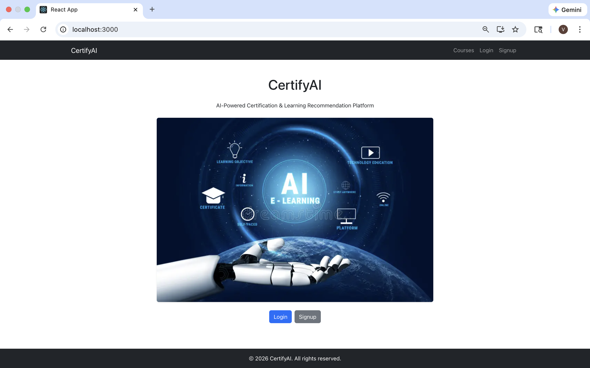

### Public Courses Page
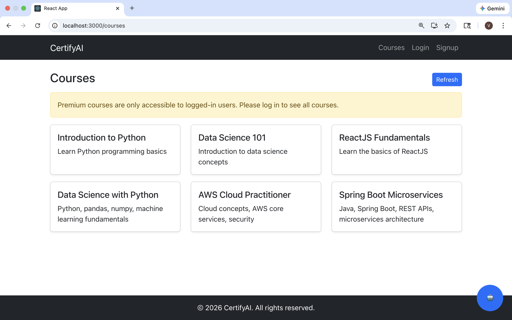

### Signup Page
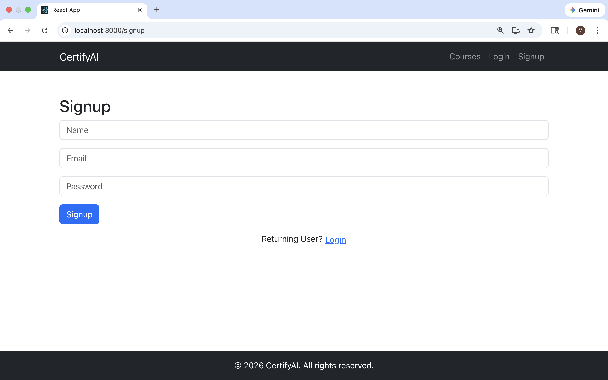

### Login Page
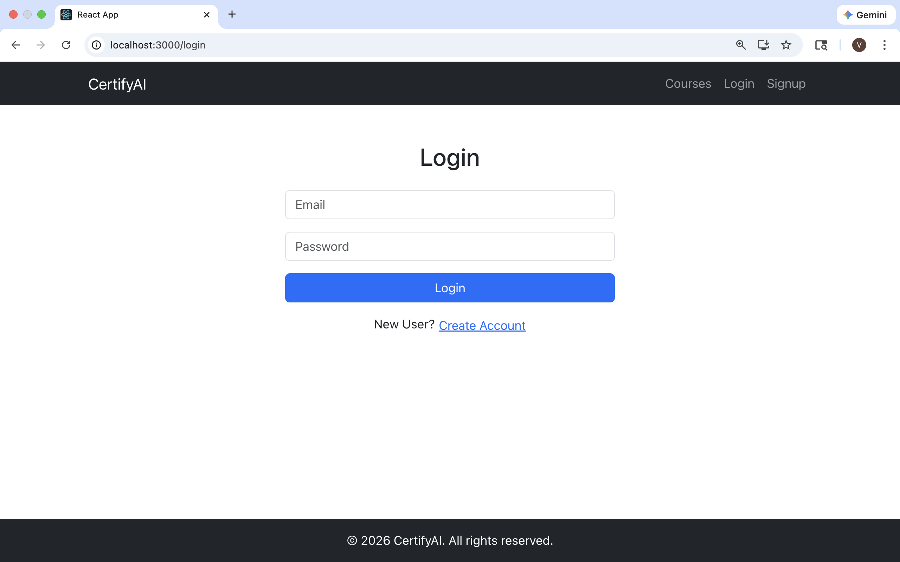

### User Dashboard
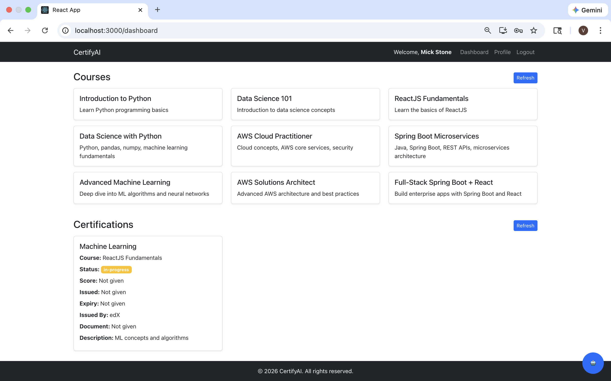

### User Profile
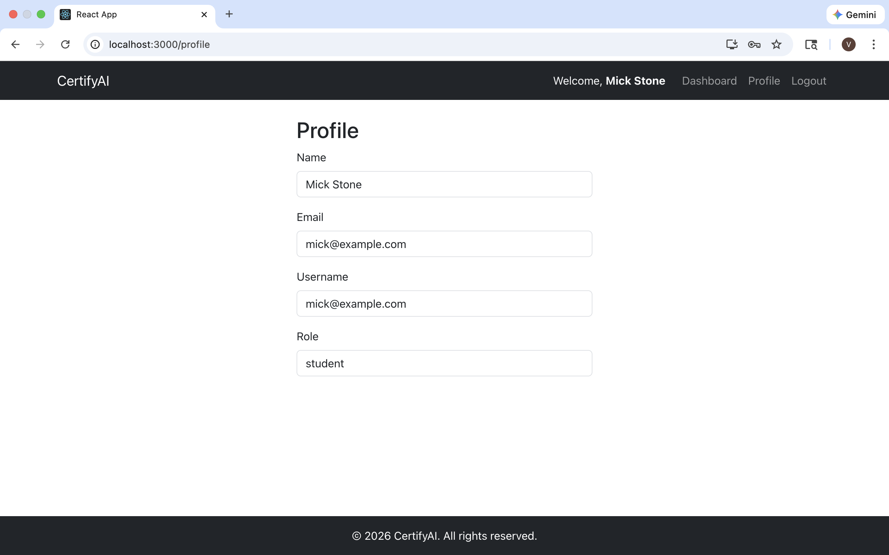

### Admin Dashboard
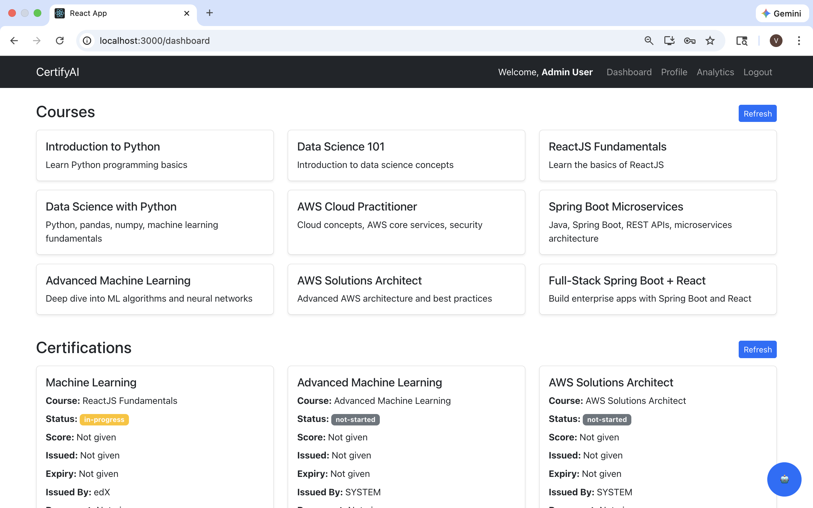

### Admin Profile
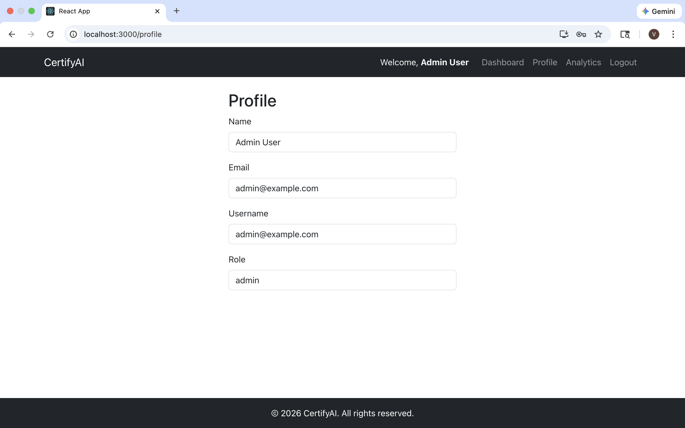

### Analytics - Charts & KPI Cards
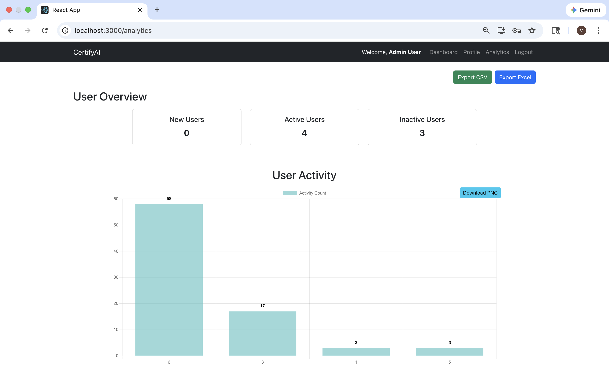

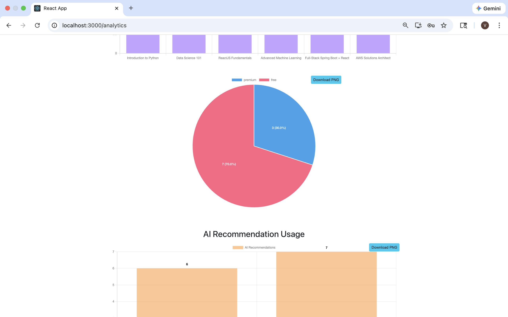
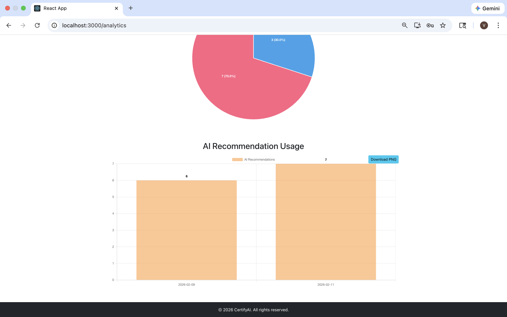

### AI Recommendations
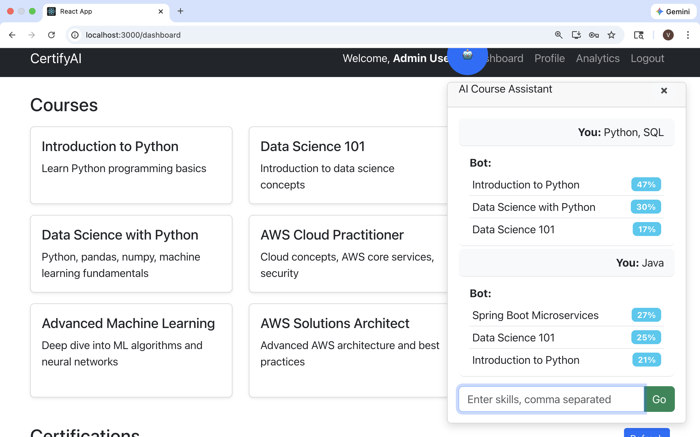

---

## 🎯 Learning Outcomes

* Built a complete full-stack application from scratch
* Integrated AI recommendations without relying on paid APIs
* Designed analytics pipelines and dashboards
* Implemented RBAC for admin-only features
* Gained hands-on experience with Docker and Kubernetes
* Understood real-world deployment and networking challenges
* Implemented CI/CD workflows

---

## 📌 Future Enhancements

* Additional features for users (e.g., notifications, course ratings, advanced filtering)
* Enhanced admin analytics dashboards
* Advanced predictive analytics
* Cloud deployment (AWS / Azure / GCP)
* Monitoring and logging (Prometheus / Grafana)
* Full RBAC backend enforcement for production-grade security

---

## 👩‍💻 Author
### Pranavi Kolipaka
Feel free to connect: 
- [LinkedIn] (https://www.linkedin.com/in/vns-sai-pranavi-kolipaka-489601208/) 
- [GitHub] (https://github.com/Pranavi2002)
